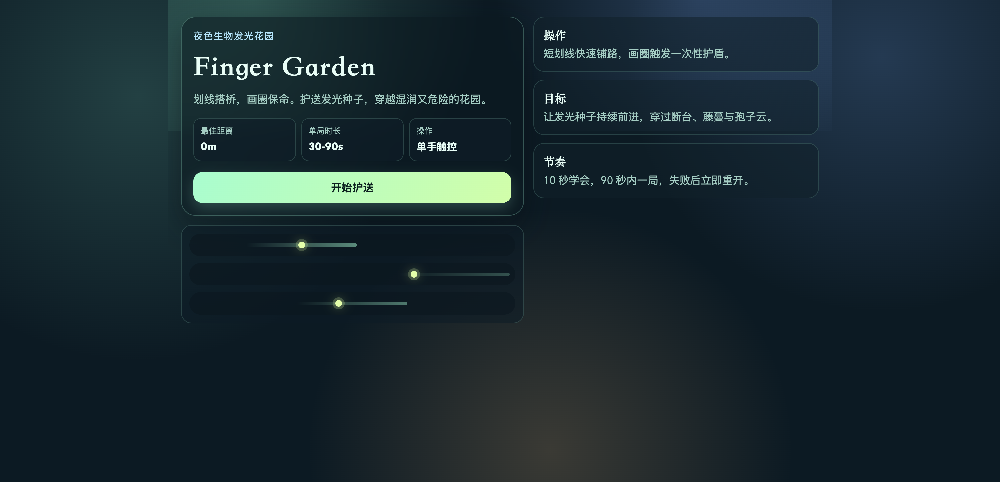

# Finger Garden


一个移动端优先的短局护送游戏。玩家护送发光种子自动前进，通过划线临时搭桥、画圈生成护盾，在危险花园里争取更远距离与更高分数。

## 游戏截图



## 玩法说明

- **自动前进**：种子会自动向前滚动
- **划线搭桥**：用手指划出线条作为临时桥梁
- **画圈护盾**：画圈为种子提供短暂保护
- **躲避障碍**：避开花园中的危险障碍物

## 运行

```bash
npm install
npm run dev
```

## 构建校验

```bash
npm run typecheck
npm run build
```

## 项目结构

- `src/App.vue`：应用入口与页面容器
- `src/components/StartPanel.vue`：开场说明与开始入口
- `src/pages/GamePage.vue`：主游戏舞台
- `src/core/`：规则、实体、渲染与输入系统
- `docs/`：重构蓝图与实施计划

## GitHub

[](https://github.com/ek0kies/finger-garden)
[](https://github.com/ek0kies/finger-garden)

---

*Built with Vue 3 + Vite - A mobile-first escort game*