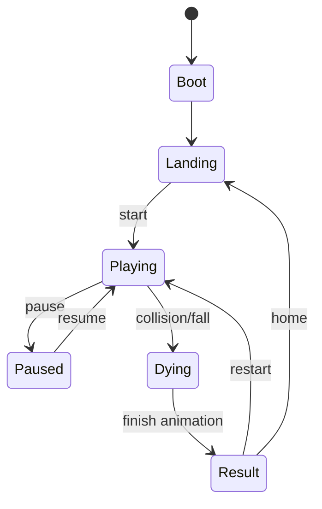

# Finger Garden 重构蓝图

## 1. 项目定位

### 1.1 一句话定义
Finger Garden 将重构为一个移动端优先的短局护送小游戏：玩家护送一颗自动前进的发光种子，靠划线临时铺路，并用简单手势施法穿过危险花园。

### 1.2 产品目标
- 让用户在 5 到 10 秒内理解玩法。
- 让用户在 30 到 90 秒内完成一局，并愿意立即重开。
- 形成明确的项目辨识度，避免落成普通 Flappy Bird clone。

### 1.3 成功标准
- 单手可玩。
- 第一局无需教程也能基本理解。
- 每次划线和施法都有强反馈。
- 新增技能、障碍或主题时，不需要继续回到单文件堆逻辑。

## 2. 范围与边界

### 2.1 In Scope
- 单局循环。
- 自动前进角色。
- 划线开路。
- 至少一个手势技能。
- 障碍、分数、失败、重开。
- 本地最高分。
- 移动端优先的舞台型界面。

### 2.2 Out of Scope
- 联网排行。
- 账号系统。
- 多人模式。
- 复杂关卡编辑器。
- WebGL 重渲染路线。

### 2.3 约束
- 技术栈保持 Vue 3 + TypeScript + Vite + Canvas 2D。
- 第一版手势数量不超过 2 个。
- 第一版优先保证手感与反馈，不追求功能堆叠。
- 结构必须支持后续增加新障碍、新主题和新手势。

## 3. 核心玩法

### 3.1 主角设定
推荐主角为发光种子。

选择理由：
- 造型简单，易于做出统一视觉风格。
- 适合漂浮、滑行、护盾包裹和尾迹发光等表现。
- 比带复杂肢体的小动物更容易控制实现成本。

### 3.2 核心循环
1. 角色自动向前移动。
2. 玩家在前方快速划线，生成短暂存在的叶脉桥或藤蔓路。
3. 角色沿路径滑行、跳跃或被托起。
4. 遇到危险时，玩家用手势施法解决局部危机。
5. 玩家收集花粉恢复能量。
6. 发生碰撞或坠落时结算并立即支持重开。

### 3.3 操作映射
第一版保留两类输入：
- 短划线或拖拽划线：生成临时路径。
- 画圈：生成一次性护盾花环。

不建议第一版加入更多手势，避免识别复杂度和教学成本过高。

### 3.4 基础规则
#### 角色规则
- 角色始终自动向右前进。
- 角色受重力影响，会自然下坠。
- 角色接触临时路径时可沿表面滑行。
- 护盾状态下可抵挡 1 次碰撞。

#### 路径规则
- 玩家划线后生成叶脉桥。
- 路径存在时间有限，建议初版为 1.2 到 1.8 秒。
- 路径总长度受能量限制，不能无限铺满屏幕。
- 路径会随时间枯萎、碎裂并消散。

#### 能量规则
- 玩家拥有基础能量槽。
- 划线按长度消耗能量。
- 护盾消耗固定能量。
- 收集花粉恢复能量。
- 能量不足时只能短距离造路，或无法施法。

#### 失败规则
- 角色坠落出边界。
- 无护盾状态碰撞障碍。
- 没有可落脚路径且未及时施法。

## 4. 障碍与资源设计

### 4.1 第一版障碍
- 断裂花台：必须用划线补路。
- 合拢藤蔓：可绕行，也可开盾硬过。
- 孢子云：减速或干扰视野，逼迫玩家预判。

### 4.2 第一版资源
- 花粉：恢复能量。
- 露珠：后续版本可考虑作为高价值奖励。

### 4.3 分数系统
建议分数由以下三部分组成：
- 存活距离。
- 收集花粉数量。
- 连续无伤奖励。

## 5. 节奏设计

### 5.1 开局 0 到 10 秒
- 只出现断台。
- 目标是让玩家自然学会划线开路。

### 5.2 中段 10 到 25 秒
- 加入合拢藤蔓。
- 目标是让玩家理解护盾的价值。

### 5.3 后段 25 秒以后
- 混合障碍组合。
- 缩短反应窗口。
- 减少容错空间。

## 6. 页面信息架构

### 6.1 LandingPage
职责：
- 展示标题。
- 给出极短玩法说明。
- 提供开始按钮。
- 展示最佳成绩。
- 通过背景演示动画传达世界观。

建议文案：
- 标题：Finger Garden
- 副文案：划线搭桥，画圈保命。

### 6.2 GamePage
职责：
- 承载主舞台 Canvas。
- 展示分数、能量和短时反馈。
- 提供暂停能力。

界面原则：
- 全屏或近全屏舞台。
- HUD 以悬浮贴边方式存在。
- 不再保留传统左侧控制台布局。

### 6.3 ResultPanel
职责：
- 展示本局距离。
- 展示花粉收集量。
- 标记是否刷新最高分。
- 提供再来一局和返回首页。

### 6.4 CollectionPage
- 首版不实现。
- 保留后续扩展作品收藏或主题收集的可能性。

## 7. 状态机设计



## 8. 系统架构

### 8.1 架构原则
- 页面层负责产品壳、引导和 HUD。
- Core 层负责游戏状态、实体、碰撞、生成器和渲染。
- 输入识别与游戏规则解耦。
- 渲染职责与实体更新职责解耦。

### 8.2 推荐目录结构
```text
src/
  app/
    router.ts
    bootstrap.ts
  pages/
    LandingPage.vue
    GamePage.vue
  components/
    GameHud.vue
    StartPanel.vue
    ResultPanel.vue
    EnergyBar.vue
  composables/
    useGameSession.ts
    useBestScore.ts
    useGestureInput.ts
  core/
    game/
      engine.ts
      state.ts
      loop.ts
      difficulty.ts
      collision.ts
      spawner.ts
    entities/
      player.ts
      path.ts
      obstacle.ts
      pickup.ts
    gestures/
      recognizer.ts
      strokeSampler.ts
      circleRecognizer.ts
    render/
      renderer.ts
      backgroundRenderer.ts
      playerRenderer.ts
      pathRenderer.ts
      obstacleRenderer.ts
      effectRenderer.ts
    systems/
      energySystem.ts
      scoreSystem.ts
      storageSystem.ts
  constants/
    game.ts
    theme.ts
  styles/
    tokens.css
    base.css
    game.css
  types/
    game.ts
```

## 9. 模块职责

### 9.1 app 层
- 负责应用入口。
- 初始化路由和全局样式。
- 负责非游戏核心的页面跳转。

### 9.2 pages 层
- LandingPage：负责开始前的产品表达。
- GamePage：负责舞台承载和 HUD 布局。

### 9.3 composables 层
- useGameSession：连接页面与游戏引擎。
- useBestScore：封装本地最高分存取。
- useGestureInput：负责桥接指针输入和手势识别。

### 9.4 core/game 层
- engine.ts：驱动整局游戏，统一更新时钟。
- state.ts：维护 boot、landing、playing、paused、dying、result 等状态。
- loop.ts：封装 requestAnimationFrame 循环与 delta time。
- difficulty.ts：维护速度、密度、容错等难度曲线。
- collision.ts：负责角色与路径、障碍、资源之间的碰撞。
- spawner.ts：根据难度生成障碍与花粉。

### 9.5 core/entities 层
- player.ts：角色位置、速度、半径、护盾状态、存活状态。
- path.ts：临时路径、寿命、碰撞宽度、衰减。
- obstacle.ts：障碍类型、位置、尺寸、危险状态。
- pickup.ts：资源类型、位置、价值。

### 9.6 core/gestures 层
- strokeSampler.ts：采样用户笔迹。
- recognizer.ts：统一手势识别入口。
- circleRecognizer.ts：识别护盾手势。

### 9.7 core/render 层
- renderer.ts：统一管理渲染顺序。
- backgroundRenderer.ts：负责动态背景。
- playerRenderer.ts：负责主角和尾迹。
- pathRenderer.ts：负责叶脉桥、消散动画。
- obstacleRenderer.ts：负责植物类障碍。
- effectRenderer.ts：负责收集、护盾、死亡粒子等特效。

### 9.8 core/systems 层
- energySystem.ts：处理能量消耗与恢复。
- scoreSystem.ts：处理距离、收集和连击。
- storageSystem.ts：处理本地最高分持久化。

## 10. 数据模型建议

建议统一以下核心模型：
- GameState
- Player
- PathSegment[]
- Obstacle[]
- Pickup[]
- ScoreState
- EnergyState
- InputStroke

关键字段建议：
- Player: x, y, vx, vy, radius, shield, alive
- PathSegment: points, ttl, strength, collisionWidth
- Obstacle: type, x, y, width, height, dangerous
- Pickup: type, x, y, value
- EnergyState: current, max, regenCooldown
- ScoreState: distance, pollen, combo, best

## 11. 物理与碰撞策略

### 11.1 第一版实现原则
- 不引入复杂刚体系统。
- 优先保证手感稳定、规则可解释。
- 用简单碰撞体换取更快落地和更容易调参。

### 11.2 推荐模型
- 角色：圆形碰撞体。
- 路径：折线采样后转成粗线段碰撞区域。
- 障碍：矩形或胶囊形碰撞区域。
- 落到路径时采用简化的吸附滑行。
- 护盾只负责一次碰撞豁免，不做反射。

## 12. 手势识别策略

### 12.1 第一版识别范围
- 所有非闭环笔迹默认视为路径输入。
- 画圈识别成功时触发护盾。

### 12.2 识别原则
- 宁可宽松，不要过严。
- 识别失败时优先降级为普通划线。
- 避免出现“明明画了却没有反应”的体验。

### 12.3 画圈判定建议
- 起点与终点距离足够近。
- 包围盒宽高比接近圆形。
- 笔迹长度达到最低阈值。

## 13. 视觉蓝图

### 13.1 视觉方向
夜色生物发光花园。

### 13.2 关键词
- 湿润
- 呼吸感
- 荧光
- 半透明
- 柔软危险

### 13.3 色彩建议
- 背景：深青绿、深湖蓝、近黑墨绿。
- 主发光：荧光青、叶绿、微金色。
- 危险提示：品红红橙，小范围点缀。
- HUD：轻量半透明，不做传统大面板。

### 13.4 反馈设计
- 划线路径出现时有叶脉发芽动画。
- 护盾触发时有花环脉冲。
- 收集花粉时有微闪和漂浮粒子。
- 失败时炸开花粉和碎叶，再进入结果页。

## 14. 音效方向

第一版可以暂不接入完整音频系统，但需要为后续预留：
- 划线：枝叶生长声。
- 护盾：柔和脉冲音。
- 收集：清脆粒子音。
- 失败：低频花粉散落音。

## 15. 技术选型建议

保留：
- Vue 3
- TypeScript
- Canvas 2D
- Vite

建议新增：
- vue-router

当前不建议默认加入 Pinia，理由如下：
- 首版复杂度在游戏核心，而不是页面间共享状态。
- 使用 composable + core state 足以支撑首版。
- 等主题、收藏和更多页面状态出现后再引入会更合理。

## 16. 实施顺序

### 16.1 第一阶段：重建骨架
- 建立路由。
- 拆分 Landing 和 Game 页面壳。
- 清理当前单文件入口。
- 建立 core/game 基础目录。

### 16.2 第二阶段：跑通最小循环
- 自动前进。
- 坠落。
- 路径生成。
- 基础碰撞。
- 分数和失败。

### 16.3 第三阶段：补技能和资源
- 护盾手势。
- 能量系统。
- 花粉收集物。
- 难度曲线。

### 16.4 第四阶段：打磨表现
- 背景动效。
- 粒子反馈。
- 结果页表现。
- 移动端触控优化。

## 17. 里程碑定义

### M1
- 可开局。
- 可死亡。
- 可重开。
- 仅包含划线开路。

### M2
- 加入护盾。
- 加入能量系统。
- 加入基础障碍组合。

### M3
- 完整视觉。
- 结果页。
- 本地最高分。
- 核心体验打磨。

## 18. 风险点
- 路径碰撞手感是项目成败关键，必须优先验证。
- 手势识别若过严，用户会直接失去信任。
- 移动端和桌面端屏幕尺寸差异大，需要分别调参。
- 第一版若贪多加入太多技能，核心循环会被稀释。

## 19. 推荐决策
- 主角：发光种子。
- 技能：首发仅保留划线和画圈。
- 视觉：夜色生物发光花园。
- 架构：Vue 页面壳 + Canvas 游戏引擎。
- 状态管理：首版不强制引入 Pinia。

## 20. 验收标准
- 玩家第一次上手 10 秒内能理解“划线搭桥”。
- 画圈护盾能够稳定触发。
- 一局中至少能自然形成一次“险些失败但被技能救回”的体验。
- 新增障碍或技能时，不需要继续回到单一大文件中修改。
